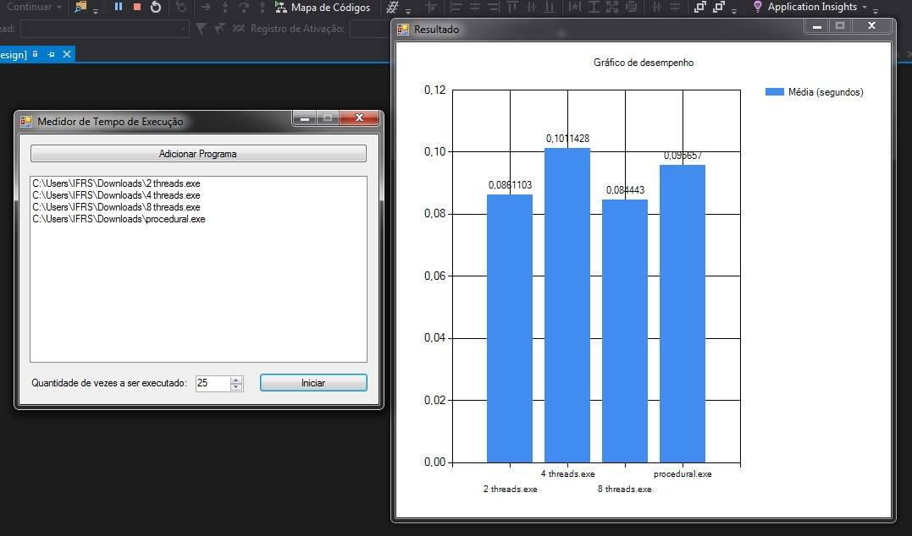

# Medidor de Tempo de Execução

Código-fonte do utilitário desenvolvido em C# para fazer média de tempo de execução de programas. 

**Executável portátil disponível [aqui](https://github.com/agharium/MedidorDeTempoDeExecucao/releases/download/stable/MedidorTempoDeExecucao.exe) - Requisito: [.NET Framework 4.6](https://download.microsoft.com/download/C/3/A/C3A5200B-D33C-47E9-9D70-2F7C65DAAD94/NDP46-KB3045557-x86-x64-AllOS-ENU.exe)**

Versão atual: **1.1**

Este pequeno projeto foi criado para servir como auxílio em testes de desempenho de algoritmos focados em processamento paralelo (threads) desenvolvidos em linguagem C durante a disciplina de **Programação com Objetos Distribuídos** (2018/01) ministrada pelo **Prof. Timoteo Alberto Peters Lange** como parte do curso de **Análise e Desenvolvimento de Sistemas** no **Instituto Federal de Educação, Ciência e Tecnologia do Rio Grande do Sul (IFRS)**, campus Osório.

## Metas de implementação

- ~~Permitir o usuário escolher a quantidade de vezes o programa deve ser executado para teste;~~
- ~~Medir mais de um arquivo de uma única vez;~~
- ~~Gerar gráfico da média de tempo de execução dos programas processados mediante escolha do usuário;~~
- Permitir o usúario atrelar títulos a cada programa escolhido para testar;
- Permitir o usuário definir um título para o teste;
- Gerar JPG ou PDF do gráfico com os títulos e nomes escolhidos pelo usuário;
- Colocar configuração da máquina na janela "Resultado";
